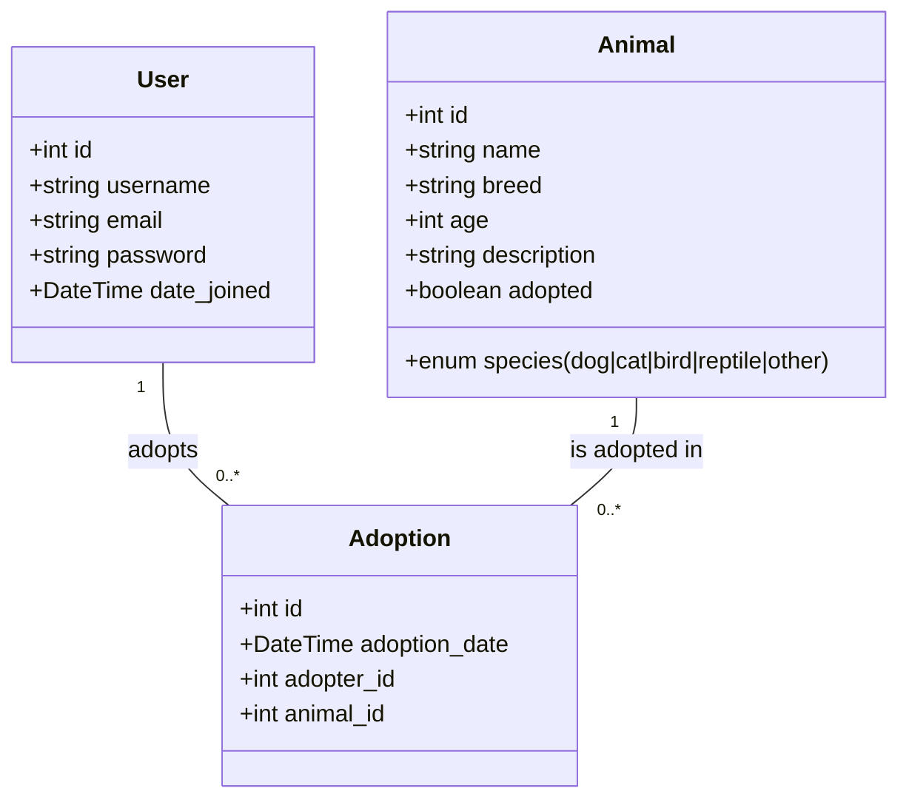

# Sistema de Adoção de Animais


Aplicação Django para gerenciar um abrigo de animais: cadastro de animais, controle de adoções e autenticação de usuários. Interface moderna com Bootswatch (tema Lux) e Bootstrap Icons, além de componentes utilitários próprios (.btn-icon e .btn-cta).

## Stack
- Python 3.12
- Django 4.2
- SQLite (dev)
- Bootstrap 5 (Bootswatch Lux) + Bootstrap Icons

## Como rodar
```bash
# 1) Criar e ativar o ambiente
python -m venv .venv
source .venv/bin/activate

# 2) Instalar dependências
pip install --upgrade pip
pip install -r requirements.txt

# 3) Migrar o banco
python manage.py makemigrations
python manage.py migrate

# 4) Criar superusuário (opcional)
python manage.py createsuperuser

# 5) Rodar o servidor
python manage.py runserver 0.0.0.0:8000
```

Atalhos com Makefile (opcional):
```bash
# Instalar deps, migrar e subir
make setup
make migrate
make run                # HOST=127.0.0.1 PORT=8000 para customizar

# Testes e cobertura
make test
make cov

# Seeds
make seed-animals COUNT=10 IMAGES=generate
make seed-adoptions COUNT=12 MODE=mix

# Utilidades
make lint
make check
make superuser

# Demo completa (setup + migrate + seeds + run)
make demo COUNT=10 IMAGES=generate ADP_COUNT=15 MODE=mix CREATE_USERS=5 HOST=0.0.0.0 PORT=8000
```

Acesse:
- App: http://localhost:8000/
- Admin: http://localhost:8000/admin/

## Funcionalidades
- Animais
	- Cadastro/edição/remoção com upload de imagem.
	- Campo de disponibilidade: “adotado” (sincronizado automaticamente quando há adoção aprovada).
	- Campo `created_by` registra o criador do animal.
	- Filtros por espécie, status e texto.
	- Listagem com coluna “Status” (Adotado/Disponível) e “Espécie” em português.
- Adoções
	- Criação de solicitação de adoção por qualquer usuário autenticado (status inicial: pendente; adotante = usuário logado).
	- Atualização/remoção de adoções restrita ao criador do animal ou staff/superuser.
	- Apenas UMA adoção “aprovada” por animal (constraint + validação de modelo).
	- Ao aprovar, o animal correspondente passa a “adotado”; ao rejeitar, permanece disponível.
	- Listagem com coluna “Status” e destaque visual por linha (verde=aprovada, amarelo=pendente, vermelho=rejeitada).
- Usuários
	- Autenticação padrão do Django.
	- Listagem de usuários visível apenas para staff.
- UI/UX
	- Tema Lux, ícones do Bootstrap, botões utilitários `.btn-icon` e `.btn-cta` com alto contraste e foco acessível.
	- Layouts responsivos; formulários com espaçamentos consistentes.

## Regras de permissão (resumo)
- Animais
	- Criar: qualquer usuário autenticado.
	- Editar/Excluir: somente o criador do animal ou staff/superuser.
	- Editar/Excluir é bloqueado para animais já adotados (server-side e escondido no front).
- Adoções
	- Criar: qualquer usuário autenticado; adotante é fixado no usuário logado; status inicial “pendente”.
	- Editar/Excluir: criador do animal ou staff/superuser; campos de animal/adotante são travados na edição.
	- Única adoção aprovada por animal (o modelo valida e há UniqueConstraint).

## Regras de negócio (comportamentos importantes)
- `Animal.adopted` é sincronizado com o estado das adoções aprovadas.
- Uma adoção aprovada impede aprovar outra para o mesmo animal.
- Usuários comuns não escolhem “adotante” nem “status” ao criar/editar adoções (status e adotante são definidos automaticamente para eles).

## Seeds (popular o banco)

### Animais
```bash
# Inserir animais padrão (evita duplicar por nome)
python manage.py seed_animals --force

# Inserir uma quantidade específica
python manage.py seed_animals --count 5 --force

# Gerar imagens placeholder (recomendado para demos)
python manage.py seed_animals --count 10 --with-images generate --force

# Baixar imagens placeholder (exige internet)
python manage.py seed_animals --count 10 --with-images download --force
```
Opções:
- `--count`: número de animais a criar (padrão 10)
- `--with-images`: `none` | `generate` | `download` (padrão `none`)
- `--force`: reexecuta mesmo com dados existentes

### Adoções
Respeita a unicidade de “aprovada” por animal e atualiza automaticamente `Animal.adopted`.

```bash
# Mistura de status (pendente/aprovada/rejeitada)
python manage.py seed_adoptions --count 12 --mode mix

# Limpar e recriar
python manage.py seed_adoptions --count 20 --mode mix --force

# Somente pendentes (ou approved / rejected)
python manage.py seed_adoptions --count 8 --mode pending

# Criar N adoções por usuário não-staff (ignora --count)
python manage.py seed_adoptions --per-user 3 --mode mix

# Criar usuários de demonstração se faltar gente
python manage.py seed_adoptions --count 10 --create-users 5

# Sequência sugerida após limpar banco/mídia
python manage.py seed_animals --count 10 --with-images generate --force
python manage.py seed_adoptions --count 15 --mode mix --create-users 5 --force
```
Opções:
- `--count`: total de adoções (padrão 10)
- `--force`: apaga adoções existentes antes de criar
- `--mode`: `mix` | `pending` | `approved` | `rejected`
- `--per-user`: cria N adoções por usuário não-staff (ignora `--count`)
- `--create-users`: cria usuários demo (`demo1`, `demo2`, ...), se necessário

### Backfill de criador do animal (`created_by`)
Para registros antigos, há um comando para preencher o campo `created_by` em massa.

```bash
# Atribuir todos os animais sem criador ao usuário "multiheros"
python manage.py backfill_animals_created_by --username multiheros --only-null

# Atribuir TODOS os animais ao usuário informado (cuidado!)
python manage.py backfill_animals_created_by --username admin --all

# Rodar em modo simulação
python manage.py backfill_animals_created_by --username admin --only-null --dry-run
```

## Estrutura do projeto (resumo)
- `apps/accounts`: autenticação e administração de usuários.
- `apps/animals`: CRUD de animais, permissões por dono/staff e status adotado.
- `apps/adoptions`: modelo e fluxo de adoções, regras de aprovação.
- `docs/`: diagramas (`.mmd` e `.puml`).
- `static/`: CSS/JS (inclui utilitários `.btn-icon` e `.btn-cta`).
- `templates/`: base e includes compartilhados.

## Diagrama do Modelo de Dados

Diagrama (Mermaid) embutido para visualização direta no GitHub/VS Code:



Arquivos fonte do diagrama:
- Mermaid: `docs/data-model.mmd`
- PlantUML: `docs/data-model.puml`

Imagem pronta (sem precisar de ferramentas locais):
- `docs/data-model.svg` (link direto no repositório)

Como renderizar localmente (opcional):
- VS Code: instale extensões “Markdown Preview Mermaid Support” e/ou “PlantUML”.
- PlantUML CLI (gera PNG):
  ```bash
  plantuml docs/data-model.puml
  ```

## Troubleshooting (dicas úteis)
- TemplateSyntaxError com parênteses
	- O mecanismo de template do Django não suporta parênteses nas expressões ``. Quebre a condição em blocos aninhados.
- Data de adoção (DateField)
	- Formate com `{{ some_date|date:'d/m/Y' }}` (não use horas/minutos).
- ALLOWED_HOSTS em dev
	- Já inclui `localhost`, `127.0.0.1` e `0.0.0.0`. Ajuste conforme ambiente.
- Geração de imagens (Pillow)
	- O seed usa fallback compatível com versões novas (`multiline_textbbox`).

## Testes e Cobertura
- Rodar testes localmente:
	```bash
	python manage.py test --verbosity 2
	```
- Cobertura local (opcional):
	```bash
	pip install coverage
	coverage run manage.py test --verbosity 2
	coverage report -m
	coverage html  # gera htmlcov/index.html
	```
- Na CI, a cobertura é gerada automaticamente e o relatório HTML é publicado como artifact de build. Se você configurar um token `CODECOV_TOKEN` nos Secrets do repositório, os resultados também serão enviados ao Codecov.

## Licença
Projeto acadêmico para fins educacionais.